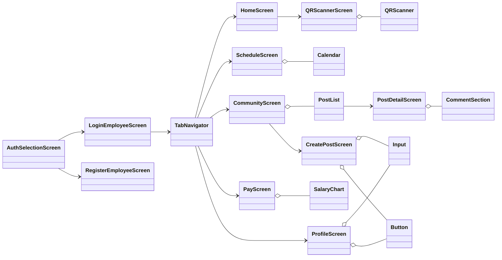
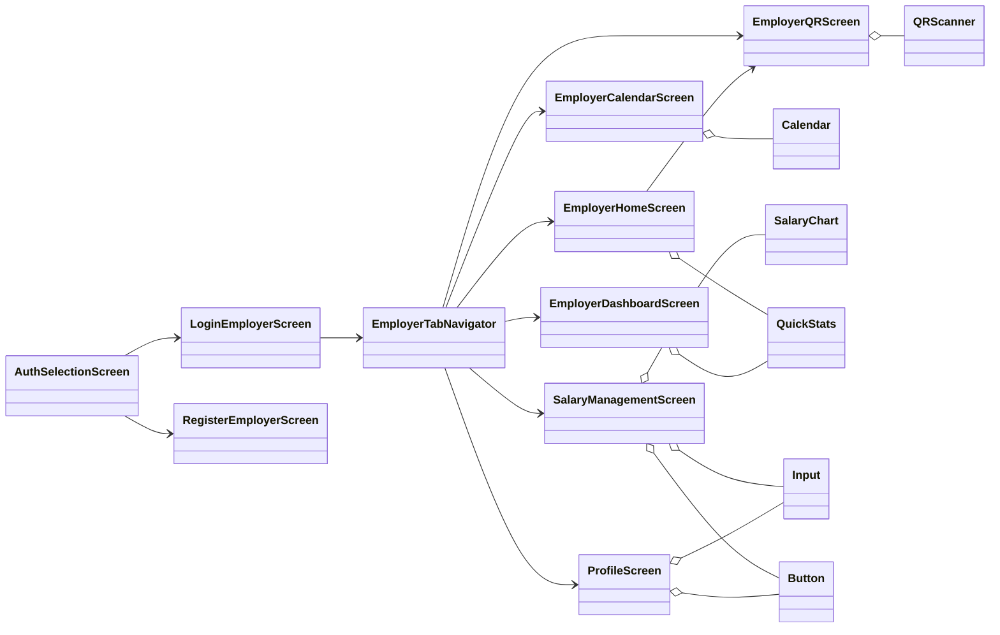

## 근로자 (Employee) 컴포넌트 다이어그램

```mermaid
classDiagram
    direction LR

    %% Classes
    class AuthSelectionScreen
    class LoginEmployeeScreen
    class RegisterEmployeeScreen
    class ProfileScreen
    class TabNavigator
    class HomeScreen
    class ScheduleScreen
    class QRScannerScreen
    class PayScreen
    class CommunityScreen
    class CreatePostScreen
    class PostDetailScreen
    class Calendar
    class QRScanner
    class PostList
    class CommentSection
    class SalaryChart
    class Input
    class Button

    %% Relationships
    AuthSelectionScreen --> LoginEmployeeScreen
    AuthSelectionScreen --> RegisterEmployeeScreen
    LoginEmployeeScreen --> TabNavigator

    TabNavigator --> HomeScreen
    TabNavigator --> ScheduleScreen
    TabNavigator --> CommunityScreen
    TabNavigator --> PayScreen
    TabNavigator --> ProfileScreen

    HomeScreen --> QRScannerScreen
    ScheduleScreen o-- Calendar
    PayScreen o-- SalaryChart
    ProfileScreen o-- Input
    ProfileScreen o-- Button

    CommunityScreen o-- PostList
    CommunityScreen --> CreatePostScreen
    PostList --> PostDetailScreen
    PostDetailScreen o-- CommentSection
    CreatePostScreen o-- Input
    CreatePostScreen o-- Button

    QRScannerScreen o-- QRScanner
```

## 고용주 (Employer) 컴포넌트 다이어그램

```mermaid
classDiagram
    direction LR

    %% Classes
    class AuthSelectionScreen
    class LoginEmployerScreen
    class RegisterEmployerScreen
    class ProfileScreen
    class EmployerTabNavigator
    class EmployerHomeScreen
    class EmployerDashboardScreen
    class EmployerCalendarScreen
    class EmployerQRScreen
    class SalaryManagementScreen
    class Calendar
    class QRScanner
    class SalaryChart
    class QuickStats
    class Input
    class Button

    %% Relationships
    AuthSelectionScreen --> LoginEmployerScreen
    AuthSelectionScreen --> RegisterEmployerScreen
    LoginEmployerScreen --> EmployerTabNavigator

    EmployerTabNavigator --> EmployerHomeScreen
    EmployerTabNavigator --> EmployerDashboardScreen
    EmployerTabNavigator --> EmployerCalendarScreen
    EmployerTabNavigator --> SalaryManagementScreen
    EmployerTabNavigator --> EmployerQRScreen
    EmployerTabNavigator --> ProfileScreen

    EmployerHomeScreen o-- QuickStats
    EmployerHomeScreen --> EmployerQRScreen
    EmployerDashboardScreen o-- QuickStats
    EmployerCalendarScreen o-- Calendar
    SalaryManagementScreen o-- SalaryChart
    SalaryManagementScreen o-- Input
    SalaryManagementScreen o-- Button
    ProfileScreen o-- Input
    ProfileScreen o-- Button
    EmployerQRScreen o-- QRScanner
```